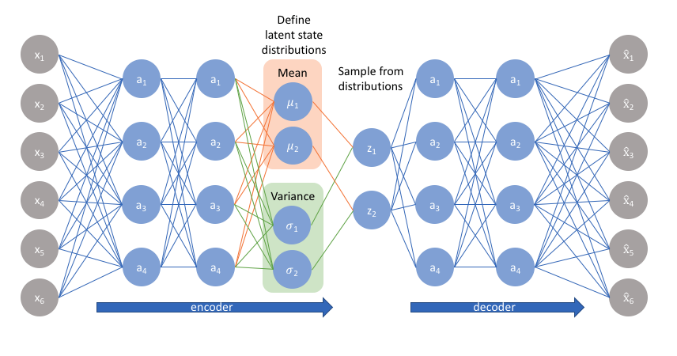

# BetaVAE
Heidi, Artjom, Siim

**Our blog**: https://medium.com/@nngroup6/55645a09f0f2

**Our repository**: https://github.com/h31d1/BetaVAE

## **Architecture**
`model.py`

 

### **BetaVAE** = **Encoder** + **Decoder**

### **Encoder**
1. **Convolutional Block**
   1. Convolutional Layer
   2. Batch Normalization Layer
   3. ReLU Activation
2. **Flattening Layer**
3. **Dense Layer** on Flatten
4. **Batch Normalization Layer** -> Mean
5. **Dense Layer** on Flatten
6. **Batch Normalization Layer** -> LogVar
7. **Sampling Layer** on Mean and LogVar
- Return Mean, LogVar, Sampling

### **Decoder**
1. **Dense Layer**
2. **Batch Normalization Layer**
3. **Reshape** (to last convolutional dimensions)
4. **Deconvolutional Block**
   1. Deconvolutional Layer
   2. Batch Normalization Layer
   3. ReLU Activation
5. **Deconvolutional Layer** to output dimensions
6. **Sigmoid Activation**
- Return Reconstruction

### **Loss** = **Reconstruction Loss** + beta * **KL Divergence**
